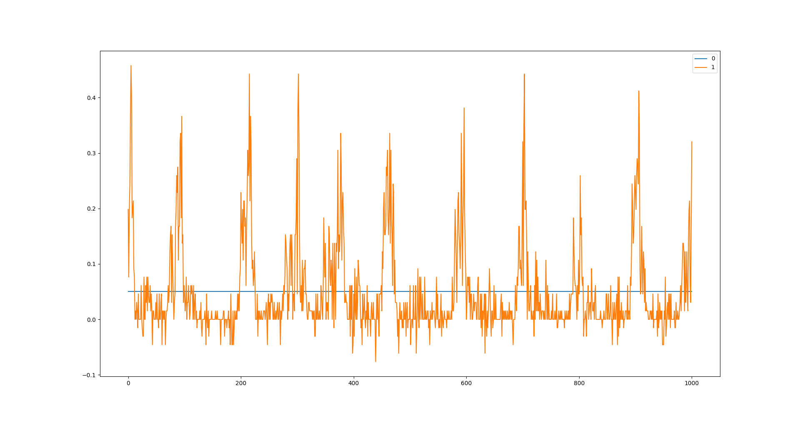
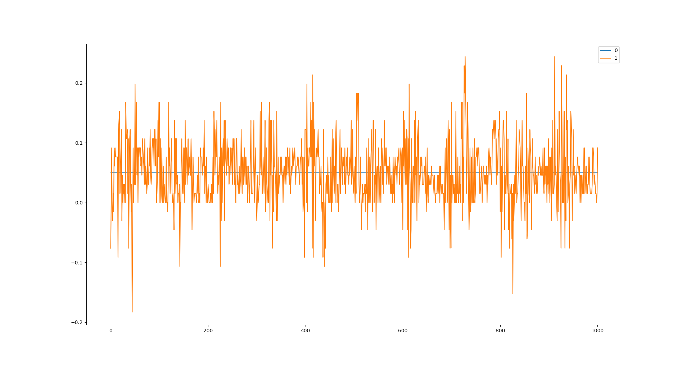
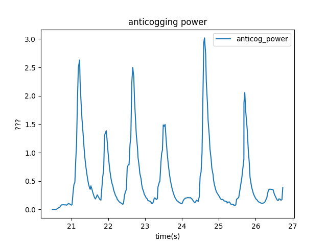
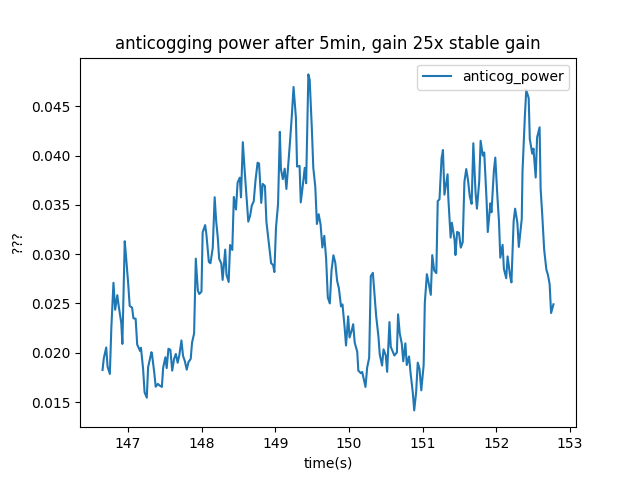
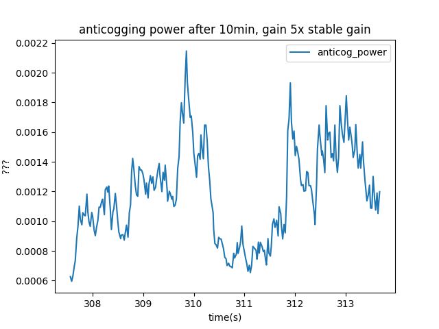

# Anti-cogging

ODrive supports an anti-cogging algorithm that attempts to compensate for the rather high cogging torques seen in hobby motors.

`<odrv>.<axis>.controller.config.anticogging` is a configuration structure that contains the following items:

Name | Type | Use
-- | -- | --
integrator_gain | float | Integrator gain used during anticogging
anticogging_max_torque | float | Max torque that the anticogging map can apply.
pre_calibrated | bool | If true and using index or absolute encoder, load anticogging map from NVM at startup
calib_anticogging | bool | True when calibration is ongoing
anticogging_enabled | bool | Enable or disable anticogging.  A valid anticogging map can be ignored by setting this to `false`

## Calibration

To calibrate anticogging, first make sure you can adequately control the motor in velocity control.  It should respond to velocity commands.

Anticogging depends on an input velocity setting and the anticogging integrator gain.

If you have an encoder with an index, set `odrv0.axisX.encoder.config.use_index = true`. Run the calibration as normal. Anticogging will work with a non-index encoder, but the calibration will have to run during *every startup*. Only with an absolute encoder or incremental + index encoder can you save the anticogging map to NVM and use it across reboots.

Start by putting the axis in `AXIS_STATE_CLOSED_LOOP` with `CONTROL_MODE_VELOCITY_CONTROL` and `INPUT_MODE_PASSTHROUGH`.  Make sure you have good control of the motor in this state (it responds to velocity commands). It is normal for the motor to experience some cogging torque in this mode before the anticogging calibration has been applied.

Make note of your stable `vel_integrator_gain`. Set `input_vel` to a low enough speed that cogging is visible. For the ODrive D5065 motor, an input_velocity of 0.04 `[turns/s]` works well. Set `vel_integrator_gain` to 0 and set `odrv0.axisX.controller.config.anticogging.anticogging_integrator_gain = <5 to 25 * vel_integrator_gain>`. 

Run `controller.start_anticogging_calibration()`.  The motor will keep turning and the cogging performance will get better over time. For the ODrive D5065 motor, unloaded, running the anticogging integrator gain at 25x vel_integrator_gain for 5 minutes works well. If better calibration is desired, reduce the anticogging integrator gain to just 5x vel_integrator_gain and let the calibration run for another 5 minutes.

To monitor the progress, you can use liveplotter or the GUI to plot `<odrv>.<axis>.controller.anticogging_correction_pwr` to see how much effort the anticogging algorithm is using. It is also useful to monitor `<odrv>.<axis>.encoder.vel_estimate` to see how well the cogging torque is being cancelled.

Here are some plots of how well the anticogging performs and what the calibration looks like as it is progressing. This was using an unloaded ODrive D5065 Motor with an CUI 102-V encoder (8192 cpr).

Pre-Anticogging velocity control:



Velocity control with anticogging active:



`<odrv>.<axis>.controller.anticogging_correction_pwr` at the beginning of the calibration:



`<odrv>.<axis>.controller.anticogging_correction_pwr` after 5 minutes of coarse tuning:



`<odrv>.<axis>.controller.anticogging_correction_pwr` after another 5 minutes of fine tuning:



It is very possible that you can set the anticogging integrator gain too high and the algorithm will get stuck or go unstable. If that happens, reboot the odrive to clear the anticogging map and then try again with a lower gain.

When you are satisfied with the performance, run `<odrv>.<axis>.controller.stop_anticogging_calibration()`. At this point, the cogging map will have a bias caused by friction. In velocity and position control, this is not a problem. You can remove the bias by setting the axis back to AXIS_STATE_IDLE and running `<odrv>.<axis>.controller.anticogging_remove_bias()`.

## Saving to NVM

As of v0.5.1, the anticogging map is saved to NVM after calibrating and calling `odrv0.save_configuration()`

The anticogging map can be reloaded automatically at startup by setting `controller.config.anticogging.pre_calibrated = True` and saving the configuration.  However, this map is only valid and will only be loaded for absolute encoders, or encoders with index pins after the index search.

## Example

``` Py
odrv0.axis0.encoder.config.use_index = True
odrv0.axis0.requested_state = AXIS_STATE_FULL_CALIBRATION_SEQUENCE
odrv0.axis0.encoder.config.pre_calibrated = True
odrv0.axis0.motor.config.pre_calibrated = True

odrv0.axis0.controller.config.control_mode = CONTROL_MODE_VELOCITY_CONTROL
odrv0.axis0.controller.config.input_mode = INPUT_MODE_PASSTHROUGH
odrv0.axis0.requested_state = AXIS_STATE_CLOSED_LOOP_CONTROL

odrv0.axis0.controller.config.anticogging.anticogging_integrator_gain = <5 to 25> * odrv0.axis0.controller.config.vel_integrator_gain
odrv0.axis0.controller.config.vel_integrator_gain = 0

odrv0.axis0.controller.input_vel = 0.04

odrv0.axis0.controller.start_anticogging_calibration()

# run for 5 minutes or so until performance is acceptable

odrv0.axis0.controller.stop_anticogging_calibration()
odrv0.axis0.controller.input_vel = 0
odrv0.axis0.requested_state = AXIS_STATE_IDLE
odrv0.axis0.controller.config.vel_integrator_gain = <previous stable value of vel integrator gain>
odrv0.axis0.controller.remove_anticogging_bias()

odrv0.axis0.controller.config.anticogging.pre_calibrated = True

odrv0.save_configuration()
odrv0.reboot()
```
