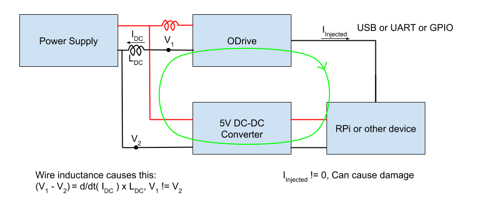
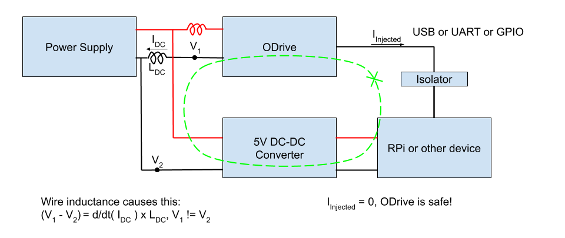

# Ground Loops

For electrical devices to communicate, most of the time they require a common ground connection. Best practice is to connect the grounds back to a single point, called a "star ground". If there are multiple paths to ground, a "ground loop" is formed. Ground loops and wire inductance can cause issues for high current electronics like ODrive. As an example of what can go wrong, look at the diagram below.

The issue is the inductance of the power wires between the ODrive and power supply. The inductance and the high current drawn by the ODrive causes V_1 to not be the same as V_2. If the voltage caused by the wire inductance and current is high enough, the 0-5V gpio signals can swing much higher or lower than the normal 0-5V range. This causes a current to flow through the ODrive GPIO pins. 

To fix this, the ground loop must be broken. This can be achieved by isolating the power supplies (no common V-) and connecting a signal ground between the RPi and ODrive. An example of this is a single ODrive connected to a battery and a device like a RPi connected to a mains power supply or different battery. If more than one ODrive is in use and they share a power supply, you have a ground loop again.

The easiest way to fix this is to isolate the data connection between the RPi and ODrive(s). The diagram below illustrates where the isolator should go.

By isolating the data connection (whether it is GPIO, USB, or UART), the ground loop is broken. Isolation can be achieved by using a USB isolator or a signal isolator for GPIO connections.